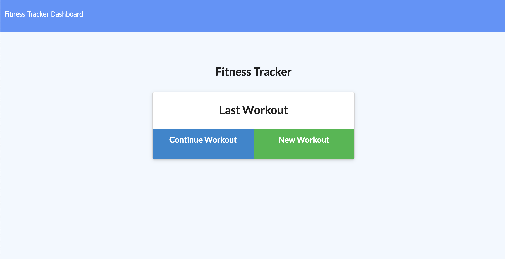
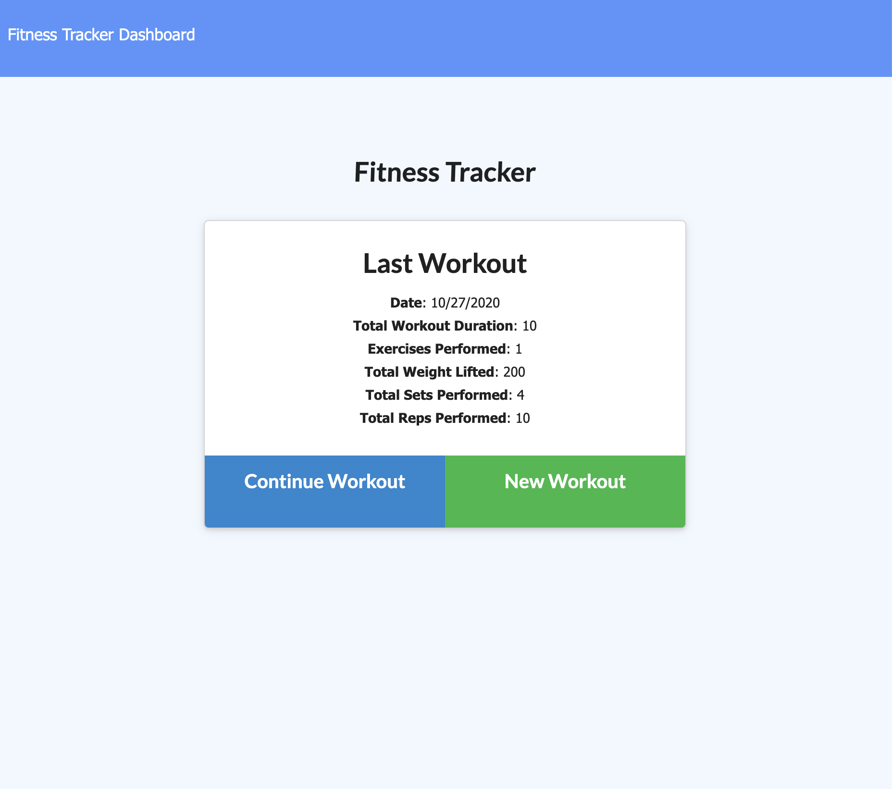
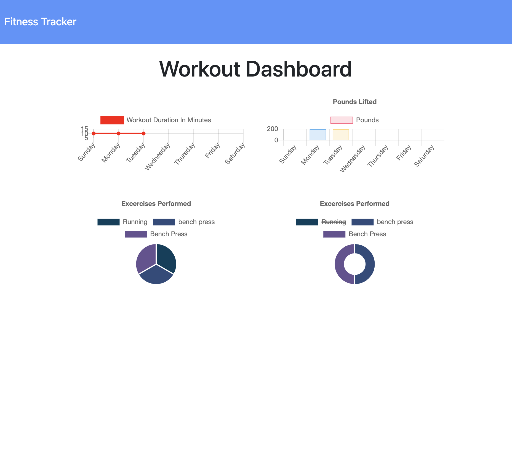
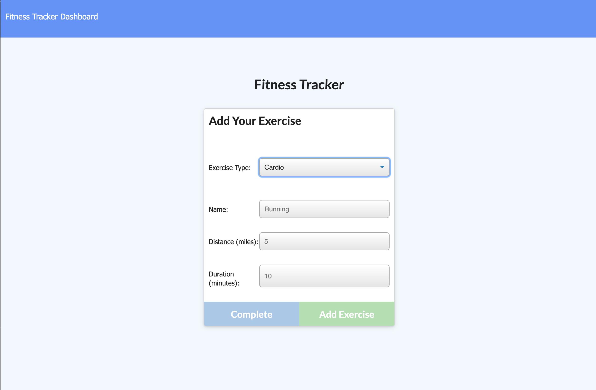

# Fitness Tracker
In this application, the user will be able enter their current workout session. They can either enter one or multiple. Once they have completed their workout they can view the dashboard. In the dashboard the user will be able to see charts. One which give the duration of the workouts per day in minutes. The second gives the lifted pounds in a week. The last gives exercises performed. 

## Deployed Website:
[https://fitness-tracker-17-2020.herokuapp.com/](https://fitness-tracker-17-2020.herokuapp.com/)

## DESCRIPTION

## SCREENSHOTS

### Landing page

### Workout when entered

### Dashboard

### Workout entry 

